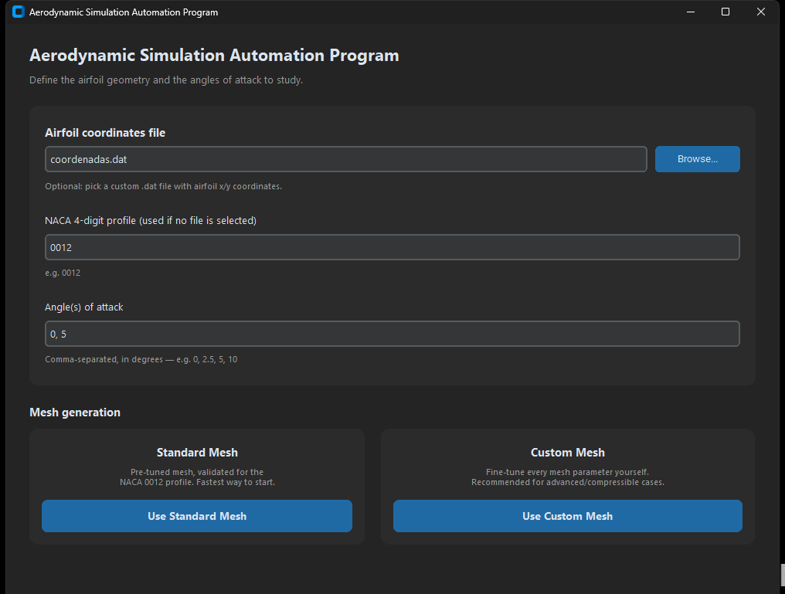
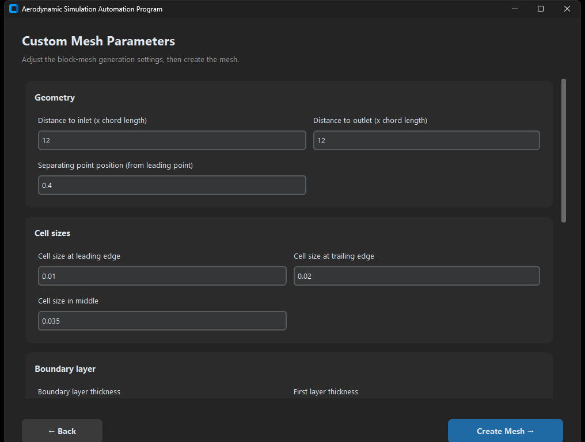
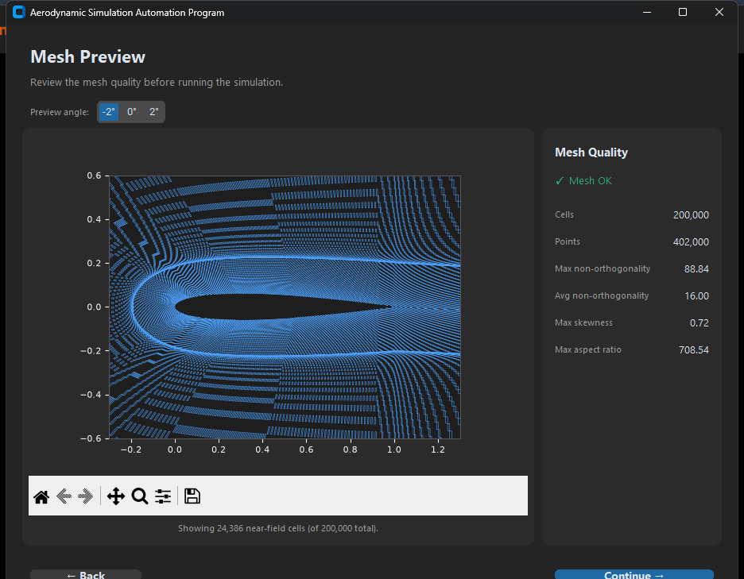
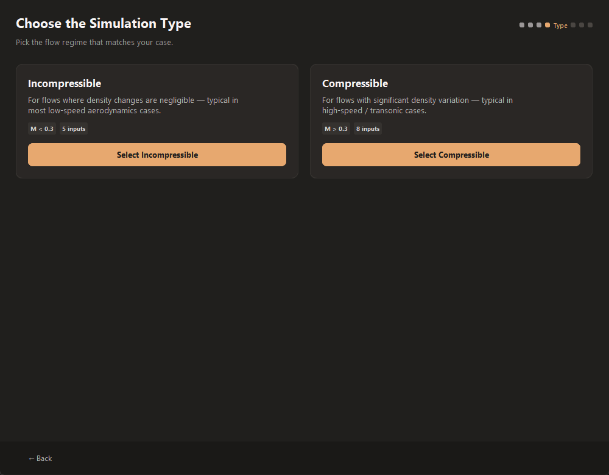
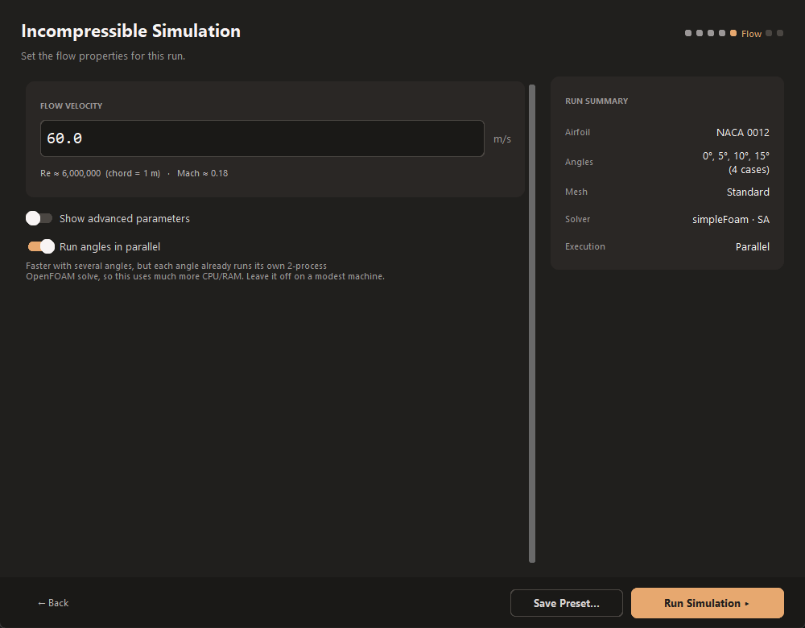
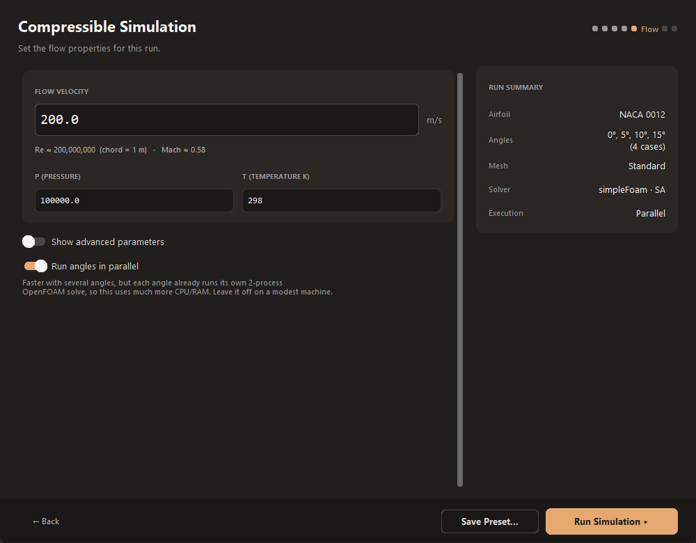
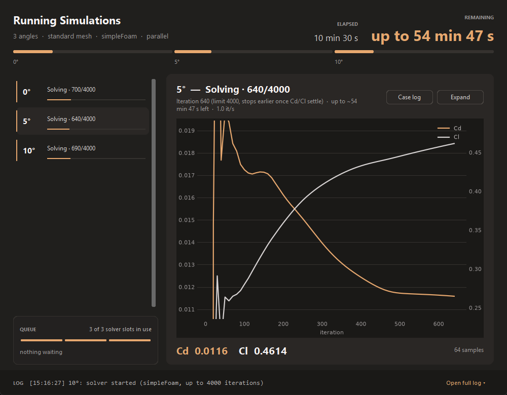
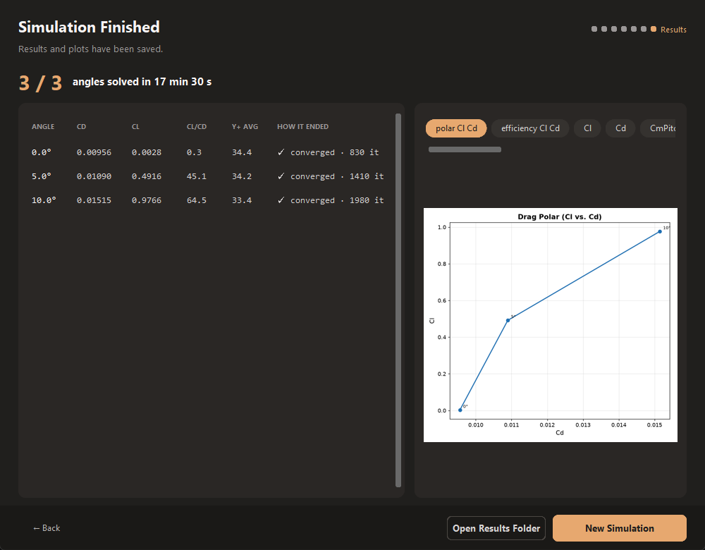

# User Manual — Aerodynamic Simulation Automation Program

This manual walks through every screen of the app. For installation
instructions, see [README.md](README.md).

## Overview

The app interacts with OpenFOAM to run aerodynamic simulations of NACA
4-digit airfoils, without requiring you to hand-edit any OpenFOAM case files.
It is aimed at aeromodeling teams, airfoil studies, and anyone getting
started with OpenFOAM who wants a guided workflow.

## 1. Main screen

On launch, the app checks in the background whether WSL and OpenFOAM are
actually installed, and shows a warning banner here if not (with the
detected problem) instead of only failing once you try to run a simulation.

| Field | Description |
|---|---|
| Airfoil coordinates file | Optional. Browse to a `.dat` file with airfoil `x y` coordinate pairs, one per line. If set, this overrides the NACA code below. |
| NACA 4-digit profile | Used when no custom file is selected. Must be exactly 4 digits, e.g. `0012`. |
| Angle(s) of attack | One or more angles in degrees, comma-separated, e.g. `0, 2.5, 5, 10`. |

Then pick a mesh type:

- **Standard Mesh** — a pre-tuned mesh validated for the NACA 0012 profile.
  Fastest way to get a result.
- **Custom Mesh** — exposes every mesh-generation parameter (see below).
  Recommended for anything other than the standard case, especially
  compressible/high-speed flows.

## 2. Custom Mesh Parameters

Only shown if you picked **Custom Mesh**. Parameters are grouped as:

- **Geometry** — distance to inlet/outlet (in chord lengths), and where the
  mesh's separating point sits relative to the leading edge.
- **Cell sizes** — target cell size at the leading edge, trailing edge, and
  in the middle of the airfoil.
- **Boundary layer** — boundary layer thickness, first-layer thickness, and
  the expansion ratio between layers.
- **Max cell sizes** — the largest allowed cell size at the inlet, outlet,
  and their junction.
- **Mesh density** — number of divisions along the boundary layer, the tail,
  the leading edge, and the trailing edge.

The tail angle is automatically adjusted to match the angle of attack so the
wake is captured correctly downstream of the airfoil.

**Load Preset...** / **Save Preset...** — the main screen has a **Load
Preset** button, and each flow-properties screen has a **Save Preset**
button, to save/load the whole setup (airfoil, angles, mesh choice and its
parameters, flow type and properties, parallel toggle) as a `.json` file.
Loading one just fills in the values; step through the normal screens
afterward to review and run it. Handy for repeating a setup or sharing one
with someone else.

Click **Create Mesh** to continue — this opens the mesh preview below rather
than jumping straight to the simulation type.

## 3. Mesh Preview

Before any simulation runs, the app generates the mesh for real (`blockMesh`)
and checks it (`checkMesh`) inside WSL, then shows:

- A wireframe of the near-field mesh around the airfoil. Use the toolbar
  under the plot to pan/zoom/reset the view — the full domain stretches many
  chord lengths further out than what's shown by default.
- Quality metrics: cell/point count, max/average non-orthogonality, max
  skewness, and max aspect ratio, with an overall ✓ **Mesh OK** / ⚠ **Mesh
  has warnings** status (mirroring `checkMesh`'s own pass/fail checks). Hover
  the **ⓘ** next to any metric for what it means and which direction (higher
  or lower) is actually better — the raw numbers alone don't tell you that.

Because the mesh depends on the angle of attack (the tail is realigned to
match it), if you entered more than one angle you can switch between them
with the **Preview angle** selector at the top — each switch regenerates and
re-checks the mesh for that angle.

If the mesh doesn't look right, click **← Back** to return to the mesh
parameters (standard mesh: back to the main screen; custom mesh: back to
the parameter form, where anything you already typed is preserved) and
adjust it — nothing has been simulated yet at this point. Otherwise, click
**Continue →** to move on.

## 4. Simulation type

- **Incompressible** — for flows where density changes are negligible
  (most low-speed aerodynamics cases).
- **Compressible** — for flows with significant density variation
  (high-speed / transonic cases).

## 5. Flow properties

### Incompressible

| Field | Default | Notes |
|---|---|---|
| Flow velocity (m/s) | — | Required |
| nu | `1e-5` | Kinematic viscosity |
| P | `0.0` | Reference pressure |
| Nut | `0.14` | Recommended: same order as `nu` |
| Nutilda | `0.14` | Recommended: ~4× `nu` |

### Compressible

| Field | Default | Notes |
|---|---|---|
| Flow velocity (m/s) | — | Required |
| P (pressure) | `1e5` | Pa |
| T (temperature K) | `298` | Kelvin |
| Alphat | `0.1` | |
| k | `0.1` | Turbulent kinetic energy |
| Nut | `0.1` | |
| Omega | `0.1` | |
| Nu | `1e-6` | Kinematic viscosity |

Toggle **Show advanced parameters** to reveal the secondary fields; they
reset to their defaults automatically when hidden again.

Toggle **Run angles in parallel** to solve multiple angles at once instead of
one after another (off by default). Each angle already runs its own
2-process OpenFOAM solve, so this multiplies CPU/RAM use accordingly — the
app caps how many angles run at the same time (based on your CPU core count,
capped at 4) rather than launching all of them simultaneously, but it's
still meant for machines with some headroom. Leave it off if a sequential run
already keeps your machine busy.

Click **Run Simulation** to start. The app switches to a progress screen and
runs the angles inside WSL — sequentially or in parallel per the toggle
above — in a background thread so the window stays responsive.

The progress screen shows, for every angle, which stage it is in (meshing,
splitting the domain, solving, merging results), the current iteration out of
the limit (e.g. `600/4000`) and an estimated time remaining. The limit is only a
ceiling: a run stops by itself as soon as Cd and Cl settle (see "When a run stops"
below), so the estimate is shown as "up to". The large
**Remaining** figure at the top is the estimate for the whole run; in parallel
mode it accounts for angles still waiting for a free solver slot (see the
**Queue** card). Click any angle in the list to see its live Cd/Cl convergence
plot (read from the running case's `coefficient.dat` every few seconds). A case
that makes no progress for 2 minutes while solving is flagged **STUCK**, and
a running log of events sits at the bottom (**Open full log** expands it).

When it finishes, you'll see a summary with buttons to open the results
folder, or to **View Results** right inside the app — a plot picker plus the
image, no need to leave the window. The main screen also gets a **View Last
Results** shortcut once a run exists, so you can revisit it anytime.

## 6. Results

### When a run stops

A case ends when **Cd and Cl stop moving**: each one must stay within an absolute
tolerance (Cd 1e-4, Cl 1e-3) of its own 200-iteration moving average, after at
least 500 iterations. This is the `convergenciaCoeficientes` block in
`system/forces`; unlike a residual target it does not depend on the mesh. The
iteration limit (`endTime` 4 = 4000 iterations at `deltaT` 0.001) is only a
safety ceiling. The results table's **How it ended** column says which happened:
`converged · 830 it`, `stable at limit`, or `not converged (limit)`. Angles close
to stall (roughly 12° and up for a NACA 0012) can need thousands of iterations;
the 15° case took ~3,250.

### Averages and validation

Each coefficient is averaged over the last 20% of the solver's iterations
(not just the final sample), which is less sensitive to residual solver
noise. An angle is flagged as **not fully converged** if Cd or Cl still
changed by more than ~2% (relative) or a small absolute tolerance across
that averaging window — the underlying flow hadn't fully settled by the
end of the run for that angle.

When the run is compared with the bundled reference data, the average difference
leaves out angles that did not converge (drawn as red × in the validation plots) and
points whose reference value is near zero (e.g. Cl at 0°, where a tiny absolute
difference becomes a huge percentage).

- `Results/results.txt` — one row per angle with `Time, Cd, Cd(f), Cd(r),
  Cl, Cl(f), Cl(r), CmPitch, CmRoll, CmYaw, Cs, Cs(f), Cs(r), yPlus_avg,
  yPlus_max, Converged`. If a simulation failed for a given angle, its row
  is filled with `nan` instead of corrupting the file.
  - `yPlus_avg` / `yPlus_max` — average/peak y+ on the airfoil wall, a
    mesh-quality check for the turbulence model's wall-function
    assumptions (typically expect low tens to a few hundred).
  - `Converged` — `1` if Cd/Cl settled within tolerance, `0` otherwise.
- `plots/data.xlsx` — the same data as a spreadsheet.
- `plots/*.png` — one plot per coefficient, coefficient vs. angle of
  attack. Points where `Converged` is `0` are marked with a red ✕ instead
  of the usual dot, so an unreliable value is never silently plotted like
  any other point.
- `plots/polar_Cl_Cd.png` — the drag polar (Cl vs. Cd), the standard way
  to compare an airfoil's lift/drag trade-off across angles.
- `plots/efficiency_Cl_Cd.png` — aerodynamic efficiency (Cl/Cd) vs. angle
  of attack.

## Error messages

- **"Please enter a valid 4-digit NACA code"** — the NACA field must contain
  exactly 4 digits.
- **"Please enter valid angles separated by commas"** — check for stray
  characters in the angle(s) field; only numbers and commas are allowed.
- **Mesh Generation Error** — usually means a custom mesh parameter is zero
  or otherwise invalid (e.g. division by zero in the grading calculation).
  Check the message for which angle failed and adjust the parameter.
- **"WSL executable not found"** — WSL isn't installed or not on `PATH`; see
  [README.md](README.md) for setup steps.
- **"Mesh generation failed" (on the Mesh Preview screen)** — `blockMesh`
  itself failed inside WSL, usually from an invalid custom mesh parameter.
  The panel on the right shows OpenFOAM's own error message; go **← Back**
  and adjust the offending parameter.
- **Simulation Finished with Errors** — one or more angles failed inside
  WSL. Check the console/terminal output the app was launched from for the
  underlying OpenFOAM error.

## Tips

- When specifying multiple angles, expect the total run time to scale with
  the number of angles — each is solved as an independent case.
- Close `plots/data.xlsx` before starting a new simulation; the app
  rewrites it on every run and Excel keeps the file locked while open.
- To change the iteration ceiling, edit `endTime` or `deltaT` in
  the relevant case's `system/controlDict` under `core/Standard/Incompressible`
  or `core/Standard/Compressible`; the stop tolerances live in `system/forces`.

## Citation

This program was developed as part of the author's undergraduate thesis
(TCC) at the University of Brasília (UnB). If you use it in academic work,
please cite the original thesis — see [LICENSE](LICENSE) for the citation
requirement attached to academic use.
